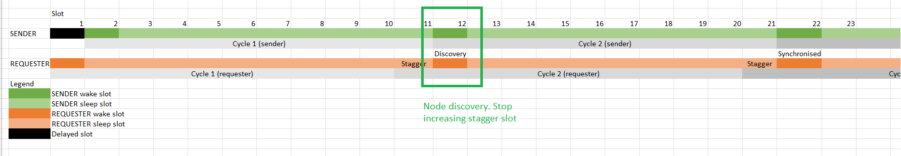

# Assignment 3: Report

## Team Information

Team Number: 9

| Team Member |      Name      | Student Number |
| :---------: | :------------: | :------------: |
|      1      |  Law Wei Jie   |   A0218249Y    |
|      2      | Wong Chee Hong |   A0217558W    |

---

## Compiling Information

Please run `sudo make TARGET=cc26x0-cc13x0 BOARD=sensortag/cc2650 PORT=/dev/ttyACM0 program_name` to compile the appropriate `program_name` for each part, with the appropriate `makefile`. 

This `makefile` is provided, and compilation for Task 1 should use `nbr`, whereas compilation for Task 2 should use `nbr-part2-requester` and `nbr-part2-sender` for the receiver (data mule) nodes and light-sensing node respectively.

---

## Methodology

In general, questions that required experimentation were ran multiple times. Please see the specific question for more detailed information about how the experiment was performed.

---

## Objective

There are two main objectives for this project, namely:

1. Implement a neighbour discovery mechanism based on the birthday protocol
1. Enhance the neighbour discovery mechanism to establish a delay-tolerant sensing application

The first task introduces the "birthday" protocol which is a probabilistic neighbour discovery mechanism. We were tasked to experiment with this and report our findings, then implement an algorithm that allows neighbour discovery within a deterministic time.

The second task requires us to perform light sensing and neighbour discovery. One node is fixed as the light sensor, while other nodes will discover it by sending data. After a certain time, the light sensing node must send data to the requesting node. We are to establish a delay-tolerant network that can send and receive data where necessary.

---

## Findings: Task 1

### Question 1

The cumulative distribution of the intervals between packet reception on A hearing from B is as follows:

      
    <em> Figure 1: Cumulative distribution of intervals on default settings</em>

 

Each time A receives a packet from B, we print out the time difference between the current timestamp and the previous timestamp that a packet is received. We repeated this for 50 receptions, giving us a total of 49 intervals.

We plotted the cumulative distribution curve by splitting the dataset into intervals increasing by 1s (i.e. 0 - 1s, 0 - 2s... etc), then finding how many packets are received during those intervals.

From our experiment, the average time for device A to discover B is approximately 4.20s, however, the longest time it took for A to discover B was 16 seconds. 
 

### Question 2

The cumulative distribution of the intervals between packets received after resetting device B is as shown:

      
    <em> Figure 2: Cumulative distribution of intervals when B reboots</em>

 

The distribution curve was plotted in the same way as in Question 1.

Modifications were made to the structure of the data packet. We added a new field, `startup_time` to denote the time in which device B booted up and sent the first packet. 

We performed the experiment 20 times manually. After each reboot of B, A prints to the serial monitor the time it took to receive the packet from B. The time taken for device A to discover B after B's bootup is the time difference between `startup_time` and the time the received packet was sent.

The average time for device A to discover B after resetting, according to our data is approximately 4.08s

 

### Question 3

The following modifications were made:
1. Change wake time (WAKE_TIME)
1. Change sleep slot (SLEEP_SLOT)
1. Change sleep cycle (SLEEP_CYCLE)

For this part of the experiment, we took the time intervals across 50 receives. As such, like before, there are 49 intervals.

The different settings we used, and the results obtained are as follows:

| Experiment Number | Setting | Average Time to Discovery (A discovers B) | Average Time to Discovery (B discovers A) | Total Number of packets sent by B | Total Number of packets sent by A |
| ------------------| ------- | ------------------------- | ------------------------| --- | -- |
| 1 | Wake time from 0.1s to 0.05s (RTIMER_SECOND/20) | 12.300s | 11.860s | 1265 | 1249 |
| 2 | Wake time from 0.1s to 0.2s (RTIMER/5) | 2.757s | 2.671s | 267 | 238 |
| 3 | Sleep cycle from 9 to 5 | 1.945s | 2.031s | 322 | 403 |
| 4 | Sleep slot from RTIMER_SECOND/10 to RTIMER_SECOND/12 | 3.976s | 4.015s | 485 | 473 |
> Table 1: Summary of the experiments and their results

The results for each modification is explained below.

The graphs of packets received in an certain interval [X, Y] is shown below for each setting:

      
    <em> Figure 3.1: Distribution of packets received against intervals for setting 1</em>

 

Figure 3.1 shows the distribution of packets received against intervals for the first setting. The table below shows the probability of receiving a packet within X seconds:

| Time (s) | Number of Packets Received | Probability of Reception |
| :------: | :------------------------: | ------------------------ |
|    10    |             29             | 29/49 = 0.591837         |
|    20    |             39             | 39/49 = 0.795918         |
|    30    |             45             | 45/49 = 0.918367         |
|    40    |             47             | 47/49 = 0.959184         |
|    50    |             47             | 47/49 = 0.959184         |
|    60    |             49             | 49/49 = 1                |

> Table 2: Summary of experiment 1 and the results

This experiment involved reducing the wake time from 0.1s to 0.05s. When the wake time is decreased to 0.05s, the average time it takes for A to discover B and vice-versa is longer as shown in the table above.

While reducing wake time reduces the duty cycle, this also lowers the chance of discover since there is less chance for two wake windows to coincide.

***

      
    <em> Figure 3.2: Distribution of packets received against intervals for setting 2</em>

 

Figure 3.2 shows the distribution of packets received against intervals for the second setting.
The table below shows the probability of receiving a packet within X seconds:

| Time (s) | Number of Packets Received | Probability of Reception |
| :------: | :------------------------: | ------------------------ |
|    2     |             23             | 23/49 = 0.469388         |
|    4     |             39             | 39/49 = 0.795918         |
|    6     |             45             | 45/49 = 0.918367         |
|    8     |             47             | 47/49 = 0.959184         |
|    10    |             48             | 48/49 = 0.979592         |
|    12    |             49             | 49/49 = 1                |

> Table 3: Summary of experiment 2 and the results

The second experiment involved increasing the wake time from 0.1s to 0.2s. When the wake time was increased to 0.2s, as expected, the average time taken for A to discover B is shorter. 

By increasing the wake time, we increase the duty cycle and the chance that two wake periods coincide with each other, reducing the time it takes for one device to discover the other.

***

      
    <em> Figure 3.3: Distribution of packets received against intervals for setting 3</em>

 

Figure 3.3 shows the distribution of packets received against intervals for the third setting.
The table below shows the probability of receiving a packet within X seconds:

| Time (s) | Number of Packets Received | Probability of Reception |
| :------: | :------------------------: | ------------------------ |
|    2     |             32             | 32/49 = 0.653061         |
|    4     |             40             | 40/49 = 0.816327         |
|    6     |             45             | 45/49 = 0.918367         |
|    8     |             48             | 48/49 = 0.979592         |
|    10    |             48             | 48/49 = 0.979592         |
|    12    |             49             | 49/49 = 1                |

> Table 4: Summary of experiment 3 and the results

The third experiment reduced the sleep cycle from 9 to 5.

When the sleep cycle is lowered to 5 (i.e. Tsleep is decreased because Tsleep = SLEEP_SLOT \* SLEEP_CYCLE), the amount of time it takes for A to discover B is shorter, and vice-versa. This is because by reducing the amount of time spent alseep per cycle, the duty cycle has increased, which increases the chance of discovery.

      
    <em> Figure 3.4: Distribution of packets received against intervals for setting 4</em>

 

Figure 3.4 shows the distribution of packets received against intervals for the fourth setting.
The table below shows the probability of receiving a packet within X seconds:

| Time (s) | Number of Packets Received | Probability of Reception |
| :------: | :------------------------: | ------------------------ |
|    3     |             26             | 26/49 = 0.530612         |
|    6     |             39             | 39/49 = 0.795918         |
|    9     |             42             | 42/49 = 0.857143         |
|    12    |             45             | 45/49 = 0.918367         |
|    15    |             48             | 48/49 = 0.979592         |
|    18    |             49             | 49/49 = 1                |

> Table 5: Summary of experiment 4 and the results

The fourth (and last) experiment conducted involved reducing the sleep slot. The sleep slot represents the time spent sleeping per slot. When the sleep slot is reduced, we reduce Tsleep. When we reduce the amount of time spent sleeping per cycle, the duty cycle increases, increasing the chance of discovery, and hence the amount of time it takes for A to discover B is also lesser.

---

### Modification of `nbr.c` for two-way discovery within 10s

The algorithm implemented to ensure they both hear from each other is the one shown in Lecture 8, Slide 51 `Asynchronous - Deterministic Bound`:

      
    <em> Figure 3.4: Distribution of packets received against intervals for setting 4</em>

We removed all the parameters, `Twake`, `Tsleep`, etc.. and instead introduced the following parameters:
1. `DISCOVER_WITHIN`
2. `N`
3. `SLOT_TIME`

Where `DISCOVER_WITHIN` stands for the upper bound time for a packet to be discovered by its neighbour. For this project, `DISCOVER_WITHIN` is set to 10 seconds as required by the project constraints.

`N` is the number of rows and columns (as in the image above), and `SLOT_TIME` is the amount of time per slot. `SLOT_TIME` is calculated as `DISCOVER_WITHIN/(N*N)`. By varying `N`, we can control the duty cycle of the discovery algorithm.

`N` is set to a value of 10, and hence the number of slots is 100. Of these 100 slots, the radio will be on for 19 of the slots, and hence our duty cycle is calculated to be 19%.

Based on our tests, the maximum 2-way discovery latency is around 9.8s. The theoretical upper-bound is set at 10s.

---

## Findings: Task 2

The algorithm implemented to ensure node discovery is different from the one we have described in Task 1. The algorithm is described in greater detail [below](#neighbour-discovery-logic).

For Task 2, since the architecture is many-to-one (where the one is the light-sensing node), the other SensorTags that are not the light-sensing node do not need to discover each other. For this purpose, we refer to the light-sensing node as the **SENDER** and the SensorTags as the **REQUESTER** (request for data). 

Furthermore, due to the amount of information that needs to be kept track of by the **SENDER**, we created a custom struct, `packet_store_struct` to include the following:
1. Source node ID, `src_id`
2. Time when it first received a packet within 3m, `in_proximity_since`
3. Time when it first received a packet further than 3m, `out_of_prox_since`
4. An array to store the past 5 RSSI values, `rssi_values`
5. A pointer to keep track of the index, `rssi_ptr`

### Neighbour Discovery Logic

Given the asymmetrical roles of the devices, the neighbour discovery algorithm used here is also different from Part 1. Both **SENDER** and **REQUESTER** devices implement different algorithms to achieve neighbour discovery within 10 seconds and has a duty cycle of 10%.

The following image shows the description of our algorithm:  

      
    <em> Figure 4: Details about the algorithm </em>

Figure 4 shows an example of how neighbour discovery is achieved with our algorithm. Assuming **SENDER** wakes up approximately 1 slot late, **REQUESTER** begins discovery early. This means that their wake slots are out of sync by 1 slot.

Since **REQUESTER** has a staggering wake slot, in cycle 2, **REQUESTER** and **SENDER** wake slot synchronises and wakes up at the same slot (slot 12) and discover each other.

We implemented a synchronisation mechanism that is shown in the 3rd cycle of Figure 4. When both **REQUESTER** and **SENDER** aligns their wake slot (in cycle 2) with each other, **REQUESTER** stops increasing the staggering of the wake slot and instead continues its current behaviour. In the case of Figure 4, it will sleep for 1 slot, wake for 1 slot, and sleep for the remaining slot.

This ensures synchronisation of the nodes. This behaviour can be extended to multiple `REQUESTER` nodes, and synchronisation should not fail upon discovery.

The logic/inspiration for this algorithm follows the Lowest Common Multiple logic. The wake slot for **REQUESTER** is staggered until it matches up with **SENDER**. The finer details of the **SENDER** and **REQUESTER** are described in the subsections below.

#### **SENDER**

Each cycle is segmented into 10 slots. The sender will always wake up the radio for the first slot, before going to sleep for the remaining 9 slots.

#### **REQUESTER**

Likewise, each cycle is segmented into 10 slots. For this algorithm, we introduce a variable `i` to stagger when the radio should wake up. When the requester first starts up, it turns on the radio at the very first slot, then sleeps for the remaining 9 slots. `i` is incremented by 1, staggering the radio wake slot to be the second slot.

Subsequently, `i` is incremented, and the radio wake slot is pushed again, until eventually it resets back to the very first slot. This algorithm is described in Figure 4.

The above algorithm ensures that the SENDER and REQUESTER will eventually find each other within a deterministic 10s (or 10 cycles), while reducing the duty cycle to 10% (from a previous 19%), which can be considered to be a major (reduced duty cycle by almost half!) improvement.

### Logic for proximity detection

Proximity detection and distance ranging is based on RSSI values. If a device is out of proximity, the received RSSI will be lower.

Using RSSI, we can estimate the distance between two nodes and determine if they are out of proximity. Using the values found in Assignment 3, the average RSSI reading at 3 meters is `-65 dBm`. 

To ensure a more robust measurement of proximity, we keep track of the last 5 RSSI values received, and take the average of the values. If the average RSSI is stronger than `-65 dBm`, we consider it to be in proximity. Since there is only 1 sender, each requesting node will keep track of the last 5 RSSI values it received from the sender. For the sender node, it will keep track of 5 RSSI values per requesting node that it detects.

If a device has received an average RSSI reading stronger than `-65 dBm` for at least 15 seconds, then we will print the `DETECT` statement. Consequently, this also begins the data transfer. More is detailed about this [below](#light-sensing-and-data-transfer-logic). Likewise, if there is an average RSSI reader weaker than `-65 dBm` for the past 30 seconds, we print `ABSENT`.

Each `DETECT` and `ABSENT` statement is only printed once, whenever it transitions from a state.

### Light Sensing and Data Transfer Logic

The light sensor is activated every 3s to take readings. Every 30s, a total of 10 light readings will be stored. The readings are kept track of using an array of size 10, and using a counter `light_data_counter` to keep track of which index to be stored at. Whenever it reaches the maximum size of 10, `light_data_counter % 10` is used to calculate which index is to be replaced.

For transferring the light readings, we decided that once the **REQUESTER** is detected to be in proximity (i.e. within 3m for >= 15 seconds) with the **SENDER**, it start to send `REQ` packets to the **SENDER**. The **SENDER** then processes this packet, and initiate the sending of the light readings stored previously. As arrays cannot be sent as it is, we created a custom struct, `light_data_arr` to store the array within the struct, then send the struct over to the **REQUESTER**.

The strategy used for transferring light readings is as follows:
1. Set a `req_flag` when **REQUESTER** is in proximity for >= 15 seconds
2. While the `req_flag` is set, all packets sent by the **REQUESTER** will be `REQ` packets. This can also double up as neighbour discovery packets, although unnecessary
3. When **REQUESTER** receives data, it checks if it is the light data. If it is, it unsets the `req_flag` and will not request for any more data from the **SENDER** while it is in proximity
4. When **REQUESTER** leaves proximity and re-enters proximity, steps 1 to 3 is repeated

The reason for steps 1 and 2 is because packets can be lost in transit, or may not be received by the **SENDER**. Therefore, we need to send multiple `REQ` packets to the **SENDER** to inform the **SENDER** to send data to that particular **REQUESTER**.

Our design also makes it such that **REQUESTER** will not request for any more data while it is in proximity.
