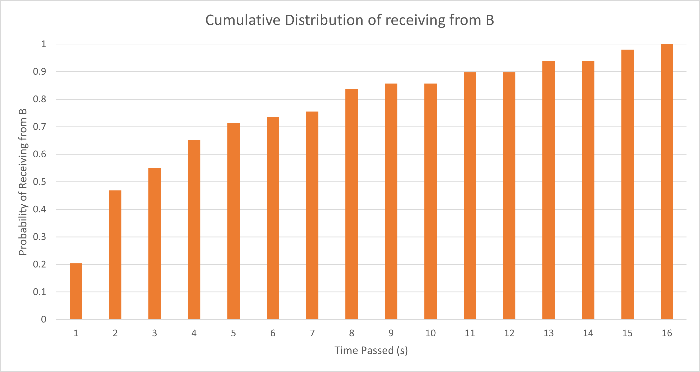
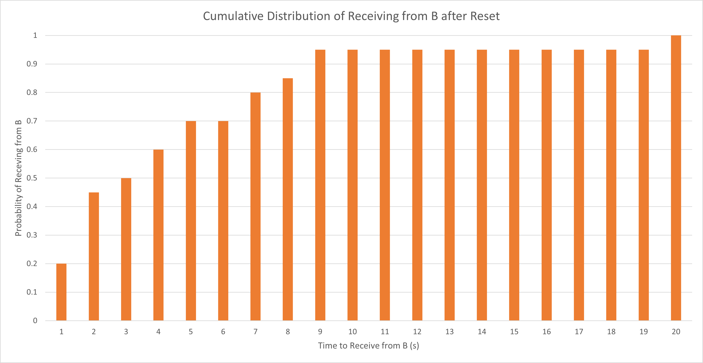
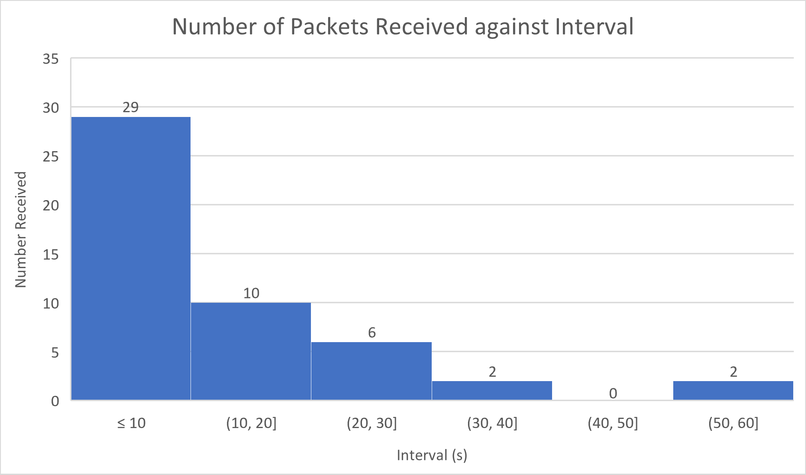
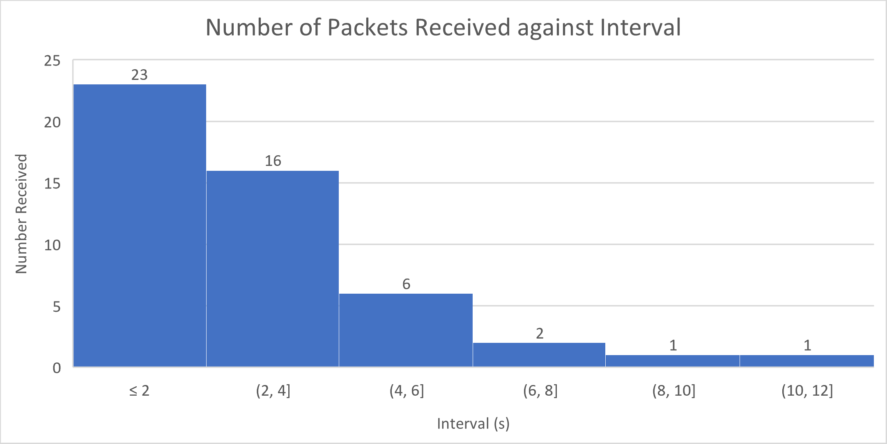
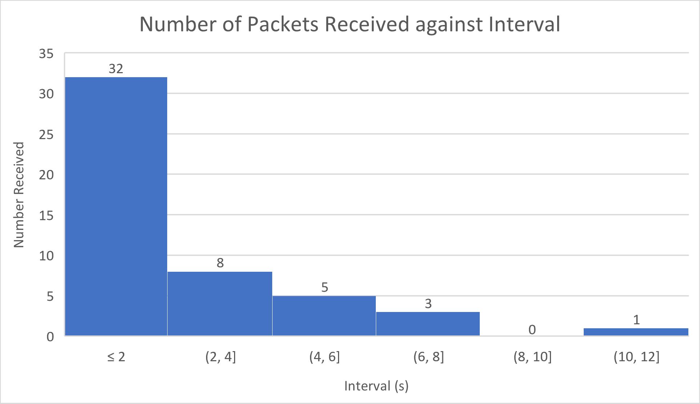
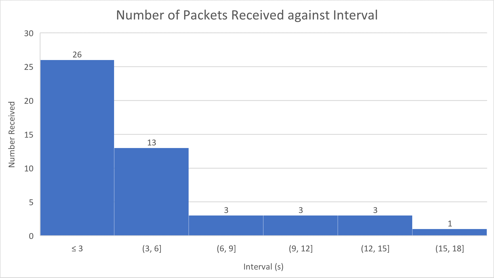
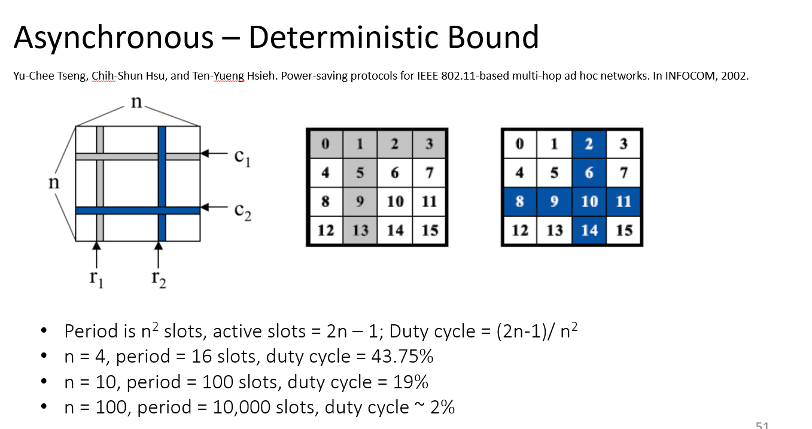
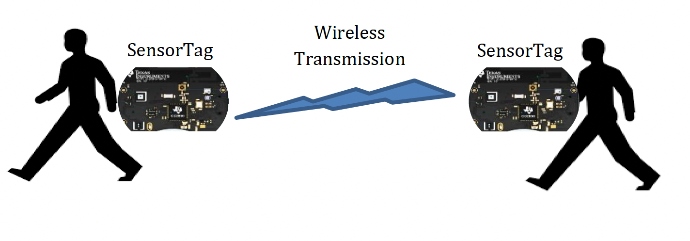
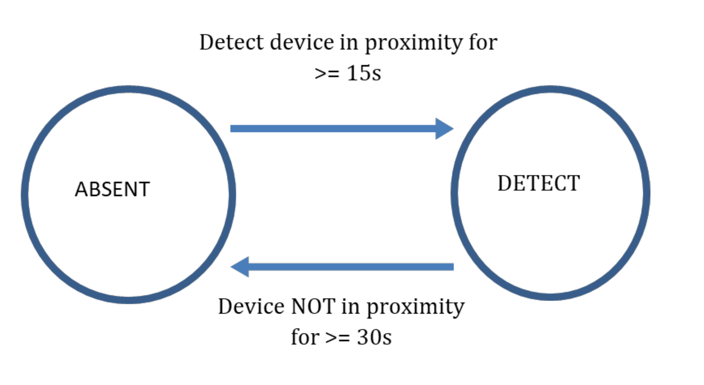

# Assignment 3: Report

## Team Information

Team Number: 9

| Team Member |      Name      | Student Number |
| :---------: | :------------: | :------------: |
|      1      |  Law Wei Jie   |   A0218249Y    |
|      2      | Wong Chee Hong |   A0217558W    |

---

## Compiling Information

Please run `sudo make TARGET=cc26x0-cc13x0 BOARD=sensortag/cc2650 PORT=/dev/ttyACM0 unicast_communication` to compile `unicast_communication.c`, with the appropriate `makefile`.

---

## Methodology

In general, questions that required experimentation were ran multiple times. Please see the specific question for more detailed information about how the experiment was performed.

---

## Objective

There are two main objectives for this project, namely:

1. Implement a neighbour discovery mechanism based on the birthday protocol
1. Enhance the neighbour discovery mechanism to establish a delay-tolerant sensing application

The first task introduces the "birthday" protocol which is a probabilistic neighbour discovery mechanism. We were tasked to experiment with this and report our findings, then implement an algorithm that allows neighbour discovery within a deterministic time.

The second task requires us to perform light sensing and neighbour discovery. One node is fixed as the light sensor, while other nodes will discover it by sending data. After a certain time, the light sensing node must send data to the requesting node. We are to estalbish a delay-tolerant network that can send and receive data where necessary.

---

## Findings: Task 1

### Question 1

> Using the default settings, observe and record how long the devices take to discover each other. Pick one of the devices as A and plot the cumulative distribution of the intervals between packet receptions on device A hearing from device B.

The cumulative distribution of the intervals between packet reception on A hearing from B is as follows:

      
    <em> Figure 1: Cumulative distribution of intervals on default settings</em>

 

Each time A receives a packet from B, we print out the time difference between the current timestamp and the previous timestamp that a packet is received. We repeated this for 50 receptions, giving us a total of 49 intervals.

We plotted the cumulative distribution curve by splitting the dataset into intervals increasing by 1s (i.e. 0 - 1s, 0 - 2s... etc), then finding how many packets are received during those intervals.

From our experiment, the average time for device A to discover B is approximately 4.20s, however, the longest time it took for A to discover B was 16 seconds. 
 

### Question 2

> Reset device B and observe how long it takes for device A to hear from device B after device B reboots. You may need to modify the given code to observe this duration. Perform the experiments at least 10 times and plot the cumulative distribution.

      
    <em> Figure 2: Cumulative distribution of intervals when B reboots</em>

 

The distribution curve was plotted in the same way as in Question 1.

Modifications were made to the structure of the data packet. We added a new field, `startup_time` to denote the time in which device B booted up and sent the first packet. 

We performed the experiment 20 times manually. After each reboot of B, A prints to the serial monitor the time it took to receive the packet from B. The time taken for device A to discover B after B's bootup is the time difference between `startup_time` and the time the received packet was sent.

The average time for device A to discover B after resetting, according to our data is approximately 4.08s

 

### Question 3

> Try out different settings and discuss your observations

The following modifications were made:
1. Change wake time (WAKE_TIME)
1. Change sleep slot (SLEEP_SLOT)
1. Change sleep cycle (SLEEP_CYCLE)

For this part of the experiment, we took the time intervals across 50 receives. As such, like before, there are 49 intervals.

The different settings we used were as follows:

| Experiment Number | Setting | Average Time to Discovery (A discovers B) | Average Time to Discovery (B discovers A) | Total Number of packets sent by B | Total Number of packets sent by A |
| ------------------| ------- | ------------------------- | ------------------------| --- | -- |
| 1 | Wake time from 0.1s to 0.05s (RTIMER_SECOND/20) | 12.300s | 11.860s | 1265 | 1249 |
| 2 | Wake time from 0.1s to 0.2s (RTIMER/5) | 2.757s | 2.671s | 267 | 238 |
| 3 | Sleep cycle from 9 to 5 | 1.945s | 2.031s | 322 | 403 |
| 4 | Sleep slot from RTIMER_SECOND/10 to RTIMER_SECOND/12 | 3.976s | 4.015s | 485 | 473 |

The results for each modification is explained below.

> Table 1: Summary of the experiments and their results

The graphs of packets received in an certain interval [X, Y] is shown below for each setting:

      
    <em> Figure 3.1: Distribution of packets received against intervals for setting 1</em>

 

Figure 3.1 shows the distribution of packets received against intervals for the first setting. The table below shows the probability of receiving a packet within X seconds:

| Time (s) | Number of Packets Received | Probability of Reception |
| :------: | :------------------------: | ------------------------ |
|    10    |             29             | 29/49 = 0.591837         |
|    20    |             39             | 39/49 = 0.795918         |
|    30    |             45             | 45/49 = 0.918367         |
|    40    |             47             | 47/49 = 0.959184         |
|    50    |             47             | 47/49 = 0.959184         |
|    60    |             49             | 49/49 = 1                |

> Table 2: Summary of experiment 1 and the results

This experiment involved reducing the wake time from 0.1s to 0.05s. When the wake time is decreased to 0.05s, the average time it takes for A to discover B and vice-versa is longer as shown in the table above.

While reducing wake time reduces the duty cycle, this also lowers the chance of discover since there is less chance for two wake windows to coincide.

***

      
    <em> Figure 3.2: Distribution of packets received against intervals for setting 2</em>

 

Figure 3.2 shows the distribution of packets received against intervals for the second setting.
The table below shows the probability of receiving a packet within X seconds:

| Time (s) | Number of Packets Received | Probability of Reception |
| :------: | :------------------------: | ------------------------ |
|    2     |             23             | 23/49 = 0.469388         |
|    4     |             39             | 39/49 = 0.795918         |
|    6     |             45             | 45/49 = 0.918367         |
|    8     |             47             | 47/49 = 0.959184         |
|    10    |             48             | 48/49 = 0.979592         |
|    12    |             49             | 49/49 = 1                |

> Table 3: Summary of experiment 2 and the results

The second experiment involved increasing the wake time from 0.1s to 0.2s. When the wake time was increased to 0.2s, as expected, the average time taken for A to discover B is shorter. 

By increasing the wake time, we increase the duty cycle and the chance that two wake periods coincide with each other, reducing the time it takes for one device to discover the other.

***

      
    <em> Figure 3.3: Distribution of packets received against intervals for setting 3</em>

 

Figure 3.3 shows the distribution of packets received against intervals for the third setting.
The table below shows the probability of receiving a packet within X seconds:

| Time (s) | Number of Packets Received | Probability of Reception |
| :------: | :------------------------: | ------------------------ |
|    2     |             32             | 32/49 = 0.653061         |
|    4     |             40             | 40/49 = 0.816327         |
|    6     |             45             | 45/49 = 0.918367         |
|    8     |             48             | 48/49 = 0.979592         |
|    10    |             48             | 48/49 = 0.979592         |
|    12    |             49             | 49/49 = 1                |

> Table 4: Summary of experiment 3 and the results

The third experiment reduced the sleep cycle from 9 to 5.

When the sleep cycle is lowered to 5 (i.e. Tsleep is decreased because Tsleep = SLEEP_SLOT \* SLEEP_CYCLE), the amount of time it takes for A to discover B is shorter, and vice-versa. This is because by reducing the amount of time spent alseep per cycle, the duty cycle has increased, which increases the chance of discovery.

      
    <em> Figure 3.4: Distribution of packets received against intervals for setting 4</em>

 

Figure 3.4 shows the distribution of packets received against intervals for the fourth setting.
The table below shows the probability of receiving a packet within X seconds:

| Time (s) | Number of Packets Received | Probability of Reception |
| :------: | :------------------------: | ------------------------ |
|    3     |             26             | 26/49 = 0.530612         |
|    6     |             39             | 39/49 = 0.795918         |
|    9     |             42             | 42/49 = 0.857143         |
|    12    |             45             | 45/49 = 0.918367         |
|    15    |             48             | 48/49 = 0.979592         |
|    18    |             49             | 49/49 = 1                |

> Table 5: Summary of experiment 4 and the results

The fourth (and last) experiment conducted involved reducing the sleep slot. The sleep slot represents the time spent sleeping per slot. When the sleep slot is reduced, we reduce Tsleep. When we reduce the amount of time spent sleeping per cycle, the duty cycle increases, increasing the chance of discovery, and hence the amount of time it takes for A to discover B is also lesser.

---

### Modification of `nbr.c` for two-way discovery within 10s

The algorithm implemented to ensure they both hear from each other is the one shown in Lecture 8, Slide 51 `Asynchronous - Deterministic Bound`:

      
    <em> Figure 3.4: Distribution of packets received against intervals for setting 4</em>

We removed all the parameters, `Twake`, `Tsleep`, etc.. and instead introduced the following parameters:
1. `DISCOVER_WITHIN`
2. `N`
3. `SLOT_TIME`

Where `DISCOVER_WITHIN` stands for the upper bound time for a packet to be discovered by its neighbour. For this project, `DISCOVER_WITHIN` is set to 10 seconds as required by the project constraints.

`N` is the number of rows and columns (as in the image above), and `SLOT_TIME` is the amount of time per slot. `SLOT_TIME` is calculated as `DISCOVER_WITHIN/(N*N)`. By varying `N`, we can control the duty cycle of the discovery algorithm.

`N` is set to a value of 10, and hence the number of slots is 100. Of these 100 slots, the radio will be on for 19 of the slots, and hence our duty cycle is calculated to be 19%.

Based on our tests, the maximum 2-way discovery latency is around 9.8s. The theoretical upper-bound is set at 10s.

---

## Part 2: Delay-tolerant Sensing and Communication

Delay-tolerant networks (DTNs) can handle long or variable delays, limited or intermittent connectivity, and often have limited bandwidth. They are useful in situations where there is no direct end-to-end communication path, such as in remote sensor networks or disaster scenarios. Apple’s AirTag and Find-my network is an example of a DTN, where nearby Apple devices act as relays to track the AirTag’s location using Bluetooth and ultra-wideband technology. This allows AirTag to be located even when out of range of its paired device.

In this project, you will design a basic implementation of such a network. One node would be sensing light readings. Next, one or more sensor tags would discover this light sensing nodes is nearby, and then receieve the accumalated light sensor readings. We describe these task in much greater detail next.

### TASK 2

Assign one of the SensorTag the task of sampling the light sensors. These light readings should be collected at an interval greater than 30 seconds. Please store last 10 collected light sensor readings in an array. You can refer to the code in the Second assignment on how to sample light sensors.

In the next step, the other sensortag should discover sensor tag with light sensor, and should transfer the collected light sensor readings. However, this transfer process should only start when the sensor tags are “in-proximity”. You can think of proximity as a distance within 3m. More specifically, the transfer should only start when the sensor tags have been in proximity for at-least 15 seconds. Furthermore, the sensor tag should also detect the condition that the sensor tag has moved away (> 3 meters) for 30 seconds or more.

More specifically, you have to perform the following tasks:

Choose one SensorTag to be responsible for sampling the light sensors.
Use the code from the Second assignment to sample the light sensors. Set the sampling interval to be greater than 30 seconds.
Store the last 10 collected light sensor readings in an array.
In order for the other SensorTags to discover the SensorTag with the light sensor, you can use code written for Task 1. Please also have the additional constraint (Detect that devices are in contact for 15 seconds or more, and secondly discover that a node in proximity has moved away for 30s or more with high probability)
Once a SensorTag detects that it is in close proximity to the SensorTag with the light sensor (within 3 meters) for a time period > 15 seconds, it has to start the transfer process for light readings.
The SensorTag with the light sensor should respond by sending the requested array to the requesting SensorTag.
Your code should output (write to stdout using printf) the time a device first detects another device in the following format:

Timestamp (in seconds) DETECT nodeID

DETECT is a keyword for detection of a NEW node. The fields are separated by a single whitespace. For example:

- 123 DETECT 34567 means that at the 123 seconds, node with ID 34567 is detected and at time 138 (123 + 15) seconds, the device 34567 is still in proximity.

When a node is determined to have moved away, print the information using the following format:

- 345 ABSENT 34567

Therefore, at the 345 seconds, node with ID 34567 moves away and until 375 (345 + 30) seconds, the device 34567 is still NOT in proximity.

Notes:

- The timestamp is a time when another node starts moving near (within ~3m) or starts moving away.
- DETECT is only printed when another node stays close for at least 15 seconds
- ABSENT is only printed when another node has moved away at least 30 seconds
- Please keep the energy consumption for performing the neighbour discovery and other task as low as possible

Finally, after the node has been successfully detected, also print the light sensor readings that were transferred. Please print them as follows:

- “Light: Reading 1, Reading 2, …. , Reading 10”

---

## Findings: Part 2

The algorithm implemented to ensure node discovery is different from the one in Task 1.

For Task 2, since the architecture is many-to-one (where the one is the light sensing node), the other SensorTags that are not the light-sensing node do not need to discover each other. For this purpose, we refer to the light-sensing node as the SLAVE and the SensorTags as the MASTER (request for data). Therefore, the algorithm works and can achieve a lower duty cycle than what was seen in Task 1.

Our algorithm has a duty cycle of 10%, i.e. it wakes for 0.1s and sleeps for 0.9s. The below diagram shows the general idea of how the algorithm was implemented, following a "lowest common multiple" logic.

// show image describing the algo

The algorithm works as such:
- A single second is split into 10 slots. Each slot is 0.1s long.
- The SLAVE node will always wake up in the first slot, then sleep for the remaining 9 slots
- The MASTER node will wake up in different slots
    - It starts by waking in the first slot, then sleeping for 9 slots
    - Next, it sleeps for 1 slot, then wakes in the second slot, and sleep for the remaining slots
    - Repeat

This ensures that the SLAVE and MASTER will find each other within a deterministic 10s. The duty cycle can be further lowered by increasing the number of slots, but this will cause the average discovery time to be longer.1
