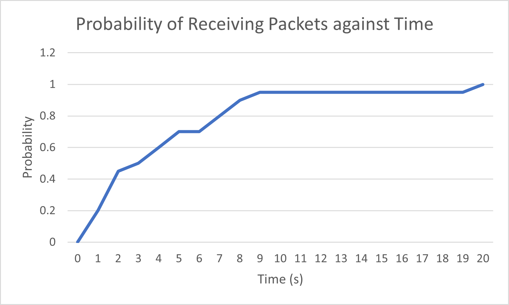
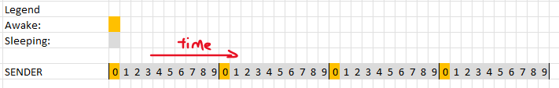
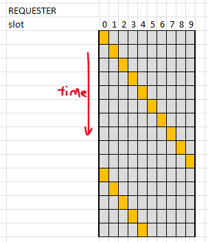
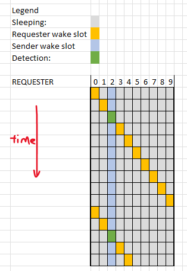

# Assignment 3: Report

## Team Information

Team Number: 9

| Team Member |      Name      | Student Number |
| :---------: | :------------: | :------------: |
|      1      |  Law Wei Jie   |   A0218249Y    |
|      2      | Wong Chee Hong |   A0217558W    |

---

## Compilation Information
- Please run `sudo make TARGET=cc26x0-cc13x0 BOARD=sensortag/cc2650 PORT=/dev/ttyACM0 program_name` to compile the appropriate `program_name` for each part
- For Task 1, run `sudo make TARGET=cc26x0-cc13x0 BOARD=sensortag/cc2650 PORT=/dev/ttyACM0 nbr`
- For Task 2, run `sudo make TARGET=cc26x0-cc13x0 BOARD=sensortag/cc2650 PORT=/dev/ttyACM0 nbr-part2-sender` and `sudo make TARGET=cc26x0-cc13x0 BOARD=sensortag/cc2650 PORT=/dev/ttyACM0 nbr-part2-requester`

Following the above steps will ensure compilation is done for all files.

To test for Task 2, please choose a device as the light-sensing node and identify its **link address**. 
Then, modify the `light_addr` variable in both source files to match the address and compile the files.

Flash the appropriate files onto each device. The light-sensing node should have the compiled `nbr-part2-sender` file flashed, and the other nodes (data mules) will have the compiled `nbr-part2-requester` file flashed.

---

## Methodology

In general, questions that required experimentation were ran multiple times. Please see the specific question for more detailed information about how the experiment was performed.

---

## Objective

There are two main objectives for this project, namely:

1. Implement a neighbour discovery mechanism based on the birthday protocol
1. Enhance the neighbour discovery mechanism to establish a delay-tolerant sensing application

The first task introduces the "birthday" protocol which is a probabilistic neighbour discovery mechanism. We were tasked to experiment with this and report our findings, then implement an algorithm that allows neighbour discovery within a deterministic time.

The second task requires us to perform light sensing and neighbour discovery. One node is fixed as the light sensor, while other nodes will discover it by sending data. After a certain time, the light sensing node must send data to the requesting node. We are to establish a delay-tolerant network that can send and receive data where necessary.

---

## Findings: Task 1

### Question 1

The cumulative distribution of the intervals between packet reception on A hearing from B is as follows:

      
    <em> Figure 1: Cumulative distribution of intervals on default settings</em>

 

Each time A receives a packet from B, we print out the time difference between the current timestamp and the previous timestamp that a packet is received. We repeated this for 50 receptions, giving us a total of 49 intervals.

We plotted the cumulative distribution curve by splitting the dataset into intervals increasing by 1s (i.e. 0 - 1s, 0 - 2s... etc), then finding how many packets are received during those intervals.

From our experiment, the average time for device A to discover B is approximately 4.20s, however, the longest time it took for A to discover B was 16 seconds.
 

### Question 2

The cumulative distribution of the intervals between packets received after resetting device B is as shown:

      
    <em> Figure 2: Cumulative distribution of intervals when B reboots</em>

 

The distribution curve was plotted in the same way as in Question 1.

Modifications were made to the structure of the data packet. We added a new field, `startup_time` to denote the time in which device B booted up and sent the first packet.

We performed the experiment 20 times manually. After each reboot of B, A prints to the serial monitor the time it took to receive the packet from B. The time taken for device A to discover B after B's bootup is the time difference between `startup_time` and the time the received packet was sent.

The average time for device A to discover B after resetting, according to our data is approximately 4.08s

### Question 3

The following modifications were made:

1. Change wake time (WAKE_TIME)
1. Change sleep slot (SLEEP_SLOT)
1. Change sleep cycle (SLEEP_CYCLE)

For this part of the experiment, we took the time intervals across 50 receives. As such, like before, there are 49 intervals.

The different settings we used, and the results obtained are as follows:

| Experiment Number | Setting                                              | Average Time to Discovery (A discovers B) | Average Time to Discovery (B discovers A) | Total Number of packets sent by B | Total Number of packets sent by A |
| ----------------- | ---------------------------------------------------- | ----------------------------------------- | ----------------------------------------- | --------------------------------- | --------------------------------- |
| 1                 | Wake time from 0.1s to 0.05s (RTIMER_SECOND/20)      | 12.300s                                   | 11.860s                                   | 1265                              | 1249                              |
| 2                 | Wake time from 0.1s to 0.2s (RTIMER/5)               | 2.757s                                    | 2.671s                                    | 267                               | 238                               |
| 3                 | Sleep cycle from 9 to 5                              | 1.945s                                    | 2.031s                                    | 322                               | 403                               |
| 4                 | Sleep slot from RTIMER_SECOND/10 to RTIMER_SECOND/12 | 3.976s                                    | 4.015s                                    | 485                               | 473                               |

> Table 1: Summary of the experiments and their results

The results for each modification is explained below.

The graphs of packets received in an certain interval [X, Y] is shown below for each setting:

      
    <em> Figure 3.1: Distribution of packets received against intervals for setting 1</em>

 

Figure 3.1 shows the distribution of packets received against intervals for the first setting. The table below shows the probability of receiving a packet within X seconds:

| Time (s) | Number of Packets Received | Probability of Reception |
| :------: | :------------------------: | ------------------------ |
|    10    |             29             | 29/49 = 0.591837         |
|    20    |             39             | 39/49 = 0.795918         |
|    30    |             45             | 45/49 = 0.918367         |
|    40    |             47             | 47/49 = 0.959184         |
|    50    |             47             | 47/49 = 0.959184         |
|    60    |             49             | 49/49 = 1                |

> Table 2: Summary of experiment 1 and the results

This experiment involved reducing the wake time from 0.1s to 0.05s. When the wake time is decreased to 0.05s, the average time it takes for A to discover B and vice-versa is longer as shown in the table above.

While reducing wake time reduces the duty cycle, this also lowers the chance of discover since there is less chance for two wake windows to coincide.

---

      
    <em> Figure 3.2: Distribution of packets received against intervals for setting 2</em>

 

Figure 3.2 shows the distribution of packets received against intervals for the second setting.
The table below shows the probability of receiving a packet within X seconds:

| Time (s) | Number of Packets Received | Probability of Reception |
| :------: | :------------------------: | ------------------------ |
|    2     |             23             | 23/49 = 0.469388         |
|    4     |             39             | 39/49 = 0.795918         |
|    6     |             45             | 45/49 = 0.918367         |
|    8     |             47             | 47/49 = 0.959184         |
|    10    |             48             | 48/49 = 0.979592         |
|    12    |             49             | 49/49 = 1                |

> Table 3: Summary of experiment 2 and the results

The second experiment involved increasing the wake time from 0.1s to 0.2s. When the wake time was increased to 0.2s, as expected, the average time taken for A to discover B is shorter.

By increasing the wake time, we increase the duty cycle and the chance that two wake periods coincide with each other, reducing the time it takes for one device to discover the other.

---

      
    <em> Figure 3.3: Distribution of packets received against intervals for setting 3</em>

 

Figure 3.3 shows the distribution of packets received against intervals for the third setting.
The table below shows the probability of receiving a packet within X seconds:

| Time (s) | Number of Packets Received | Probability of Reception |
| :------: | :------------------------: | ------------------------ |
|    2     |             32             | 32/49 = 0.653061         |
|    4     |             40             | 40/49 = 0.816327         |
|    6     |             45             | 45/49 = 0.918367         |
|    8     |             48             | 48/49 = 0.979592         |
|    10    |             48             | 48/49 = 0.979592         |
|    12    |             49             | 49/49 = 1                |

> Table 4: Summary of experiment 3 and the results

The third experiment reduced the sleep cycle from 9 to 5.

When the sleep cycle is lowered to 5 (i.e. Tsleep is decreased because Tsleep = SLEEP_SLOT \* SLEEP_CYCLE), the amount of time it takes for A to discover B is shorter, and vice-versa. This is because by reducing the amount of time spent alseep per cycle, the duty cycle has increased, which increases the chance of discovery.

      
    <em> Figure 3.4: Distribution of packets received against intervals for setting 4</em>

 

Figure 3.4 shows the distribution of packets received against intervals for the fourth setting.
The table below shows the probability of receiving a packet within X seconds:

| Time (s) | Number of Packets Received | Probability of Reception |
| :------: | :------------------------: | ------------------------ |
|    3     |             26             | 26/49 = 0.530612         |
|    6     |             39             | 39/49 = 0.795918         |
|    9     |             42             | 42/49 = 0.857143         |
|    12    |             45             | 45/49 = 0.918367         |
|    15    |             48             | 48/49 = 0.979592         |
|    18    |             49             | 49/49 = 1                |

> Table 5: Summary of experiment 4 and the results

The fourth (and last) experiment conducted involved reducing the sleep slot. The sleep slot represents the time spent sleeping per slot. When the sleep slot is reduced, we reduce Tsleep. When we reduce the amount of time spent sleeping per cycle, the duty cycle increases, increasing the chance of discovery, and hence the amount of time it takes for A to discover B is also lesser.

---

### Modification of `nbr.c` for two-way discovery within 10s

The algorithm implemented to ensure they both hear from each other is the one shown in Lecture 8, Slide 51 `Asynchronous - Deterministic Bound`:

      
    <em> Figure 3.4: Distribution of packets received against intervals for setting 4</em>

We removed all the parameters, `Twake`, `Tsleep`, etc.. and instead introduced the following parameters:

1. `DISCOVER_WITHIN`
2. `N`
3. `SLOT_TIME`

Where `DISCOVER_WITHIN` stands for the upper bound time for a packet to be discovered by its neighbour. For this project, `DISCOVER_WITHIN` is set to 10 seconds as required by the project constraints.

`N` is the number of rows and columns (as in the image above), and `SLOT_TIME` is the amount of time per slot. `SLOT_TIME` is calculated as `DISCOVER_WITHIN/(N*N)`. By varying `N`, we can control the duty cycle of the discovery algorithm.

`N` is set to a value of 13, and hence the number of slots is 169. Of these 169 slots, the radio will be on for 25 of the slots, and hence our duty cycle is calculated to be 14.79%. 
 Using `N = 13` means that each slot is 0.06 seconds long, which is long enough for the radio to transmit and receive reliably. Using any value higher than `N = 13` causes the `SLOT_TIME` to be too short, which affects the reliability of the radio.

Based on our tests, the maximum 2-way discovery latency is around 9.8s. The theoretical upper-bound is set at 10s.

---

## Findings: Task 2

The algorithm implemented to ensure node discovery is different from the one we have described in Task 1. The algorithm is described in greater detail [below](#neighbour-discovery-logic).

For Task 2, since the architecture is many-to-one (where the one is the light-sensing node), the other SensorTags that are not the light-sensing node do not need to discover each other. For this purpose, we refer to the light-sensing node as the **SENDER** and the data mule SensorTags as the **REQUESTER** (requesting for data).

Furthermore, due to the amount of information that needs to be kept track of by the **SENDER**, we created a custom struct, `packet_store_struct` to include the following:

1. Source node ID, `src_id`.
   This keeps track of which node the packet was received from
2. Time when it first received a packet within 3m, `in_proximity_since`.
   This tells us the time when it first received a packet within 3m, and allows us to decide whether to print `DETECT` or not
3. Time when it first received a packet further than 3m, `out_of_prox_since`
   This tells us the time when it first received a packet further than 3m, and allows us to decide whether to print `ABSENT` or not
4. Time when this node was last discovered, `prev_discovery_time`
   This tells us the time when the last packet was discovered. If it is has been more than 30s, we print `ABSENT` since it can no longer be detected
5. An array to store the past 5 RSSI values, `rssi_values`
   This allows us to keep a rolling average of the RSSI values received to track whether the received packet is within 3m or not
6. A pointer to keep track of the index, `rssi_ptr`
   This helps us to keep track of the index of the array in `rssi_values`
7. A variable to track the state, `state`
   This keeps track of whether this particular node is in either `ABSENT` or `DETECT` state

Similarly, the **REQUESTER** needs to keep track of certain information from the sender. Thus, we created a similar struct to the above named `sender_store_struct`. While these two structs are similar and serve similar purposes, they are **not the same**.

---

### Neighbour Discovery Logic

Given the asymmetrical roles of the devices, the neighbour discovery algorithm used here is also different from Part 1. Both **SENDER** and **REQUESTER** devices implement different algorithms to achieve neighbour discovery within 10 seconds and has a duty cycle of 10%.

The logic/inspiration for this algorithm follows the Lowest Common Multiple logic. The wake slot for **REQUESTER** is incremented until it matches up with **SENDER**. The finer details of the **SENDER** and **REQUESTER** are described in the subsections below.

#### **SENDER**

The **SENDER** implements a very naive algorithm. Each cycle is segmented into 10 slots. The sender will wake up the radio for the one slot, before going to sleep for the remaining 9 slots, as depicted in Figure 4. This cyle repeats itself, ensuring that the sender wakes up every 10 slots.

The sender will also send out a packet at the start of the wake slot, and at the end of the wake slot. 

The following image shows the description of our algorithm:

      
    <em> Figure 4: Sender wake up across time </em>

If we were to "stack" each cycle on top of each other, we would see 

      
    <em> Figure 5: Sender wake cycle </em>

#### **REQUESTER**

The **REQUESTER** implements a slightly more complicated algorithm, but also follows a cycle of 10 slots. The requester begins by keeping the radio awake for a initial starting slot `i = 0` and turns the radio off for the remaining 9 slots. If there is no detection within this cycle, the requester will pick slot `i = i+1 mod 10` for the next cycle to stay awake. Same as the sender, the requester will send out a packet at the start of the wake slot, and at the end of the wake slot.

      
    <em> Figure 6: In this example, Requester nodes starts sending at i = 0, then i = 1, 2,3,... and so forth </em>

If we were to "stack" each cycle on top of each other, we would see:

      
    <em> Figure 7: Wake slots for different cycles </em>

#### **Detection**

Detection occurs when the wake slots of node A and node B coincide. 

      
    <em> Figure 8: Illustration of packet discovery </em>

Using the protocols mentioned above for the sender and requester, we can see that the wake slots will eventually coincide.
In the figure below, the requester is started at a different time from the sender. From the requester's perspective, sender is constantly sending on slot 2.

      

      
    <em> Figures 8 & 9: Timeline of packet discovery across different cycles </em>

By setting each cycle to take 1 second, the above algorithm ensures that the SENDER and REQUESTER will eventually find each other within 10 cycles, hence a deterministic 10s discovery while keeping the duty cycle at 10%.

---

### Synchronisation

When **REQUESTER** successfully receives a discovery packet from **SENDER**, it will attempt synchronisation. Synchronisation is achieved by stopping the staggering of the wake slot (i.e. stop incrementing `i`), ensuring its subsequent wake period will coincide with the light sensing node. The requester and sender will be able to detect each other every cycle (1s discovery), increasing the amount of throughput.

      
    <em> Figure 10: Attempting synchronisation when discovery packet successfully received</em>

However, more specifically, **REQUESTER** will perform synchronisation when it receives an discovery packet that is sent at the end of the wake slot. This is to ensure successful receive of the transferred data. More details on this aspect is discussed in the section on [synchronisation details](#synchronisation-details).

---
### Logic for proximity detection

Proximity detection and distance ranging is based on RSSI values. If a device is out of proximity, the received RSSI will be lower.

Using RSSI, we can estimate the distance between two nodes and determine if they are out of proximity. Using the values found in Assignment 3, the average RSSI reading at 3 meters is `-65 dBm`.

To ensure a more robust measurement of proximity, we keep track of the last 5 RSSI values received, and take the average of the values. If the average RSSI is stronger than `-65 dBm`, we consider it to be in proximity. Since there is only 1 sender, each requesting node will keep track of the last 5 RSSI values it received from the sender. For the sender node, it will keep track of 5 RSSI values per requester node that it sees. The sender node keeps track of the `DETECT` or `ABSENT` state for each requester node, and can simultaneously be in `ABSENT` for one requester node and `DETECT` for another. 

If a device receives an average RSSI reading stronger than `-65 dBm` for at least 15 seconds, then we will print the `DETECT` statement. Consequently, this also begins the data transfer, more details about this [below](#data-transfer-logic). Likewise, if there is an average RSSI reader weaker than `-65 dBm` for the past 30 seconds, we print `ABSENT`.

Furthermore, if one node does not receive packets from a detected node for more than 30 seconds, we will also print `ABSENT`.

Each `DETECT` and `ABSENT` statement is only printed once, whenever it transitions from a state.

---

### Light Sensing

The light sensor is activated every 3s to take readings. Every 30s, a total of 10 light readings will be stored. The readings are kept track of using an array of size 10, and using a counter `light_data_counter` to keep track of which index to be stored at. Whenever it reaches the maximum size of 10, `light_data_counter % 10` is used to calculate which index is to be replaced.

---

### Data Transfer Logic

Each discovery packet contains a header which includes the sequence number. This sequence number is used for synchronisation purposes, and for indicating whether a packet is a normal discovery packet or a request packet.

For transferring the light readings, once the **REQUESTER** transitions to the `DETECT` state after being within 3m for >= 15 seconds with the **SENDER**, it will use the `REQ` header in its packets to the **SENDER**. The **SENDER** receives this packet with the `REQ` header and sends the light readings back if it is also in `DETECT` state for that node. The light readings that are sent back does not increment the sequence number.

The strategy used for transferring light readings is as follows:
1. Set a `req_flag` when **REQUESTER** enters the `DETECT` state.
2. While the `req_flag` is set, all packets sent by the **REQUESTER** will contain the `REQ` header.
3. When **REQUESTER** receives data, it checks if it is the light data. If it is, it unsets the `req_flag` and will not request for any more data from the **SENDER** while it is in proximity.
4. When **REQUESTER** leaves proximity and re-enters proximity, steps 1 to 3 is repeated

We continuously use the `REQ` header when sending packets to the **SENDER**, and only stop using the `REQ` header when we have received the data that is requested. This ensures reliable reception of the light data by the **REQUESTER** node.

Also, in the `DETECT` state, we will set the `req_flag` every 30 seconds, causing the requester to receive fresh light information every 30seconds.

---

### Synchronisation Details

When two wake slots coincide, there can be two possibilities:
1. **REQUESTER** sees a packet sent at the ***start*** of **SENDER**'s wake slot, and vice versa for the **SENDER**
2. **REQUESTER** sees a packet sent at the ***end*** of **SENDER**'s wake slot, and vice versa for the **SENDER**

This is illustrated in the diagram below:

      
    <em> Figure 11: Possible cases of packet discovery </em>

In both cases, both nodes discover each other. However, synchronisation is only performed in the second case, where **REQUESTER** sees a packet sent at the ***end*** of **SENDER**'s wake slot.

Each discovery packet contains a header which includes the sequence number. Given that sequence number begins sending at number `0`, and we send 2 packets per wake slot, this implies that a discovery packet sent at the end of a wake slot will have an **odd sequence number**. As such, **REQUESTER** synchronises only when it sees an odd numbered packet from the **SENDER**.

This is done because **REQUESTER** needs to receive information from the sender. When the **SENDER** sees the `REQ` packet from **REQUESTER**, and sends back the light reading, we need to ensure that the **REQUESTER**'s radio is listening. By synchronising on odd numbered packets, the `REQ` packet seen by the **SENDER** is sent at the start of **REQUESTER**'s wake slot, hence guaranteeing that the **REQUESTER** is still awake for the rest of the wake slot when the **SENDER** returns the light reading, as illustrated by Figure 12 below:

      
    <em> Figure 12: Outcomes of the two different cases</em>

## Enhancements Made (Bonus Marks)

With the implementation of two different algorithms, we consider this to be an enhancement to the project which consequently also reduces the duty cycle. This algorithm will synchronise the SensorTags, and has not been mentioned or introduced anywhere within the scope of the course. Further, much effort was made to explain the algorithm in-depth with the use of multiple illustrations.

Thus, we believe this should qualify for the bonus marks, or "creativity of solution".
