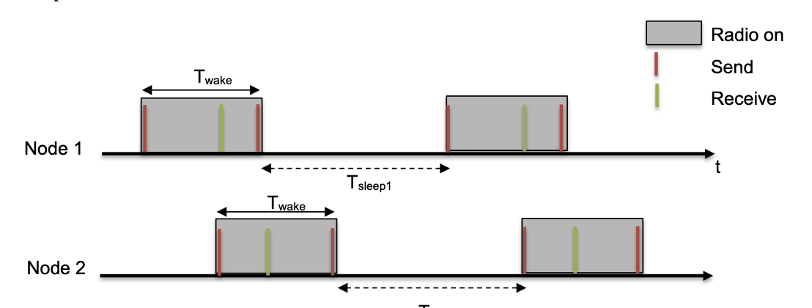
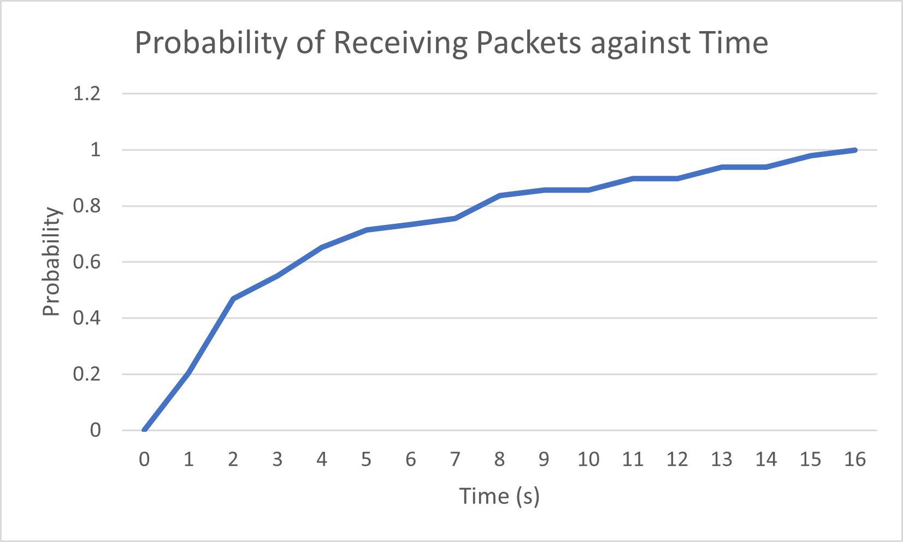

# Assignment 3: Report

## Team Information

Team Number: 9

| Team Member |      Name      | Student Number |
| :---------: | :------------: | :------------: |
|      1      |  Law Wei Jie   |   A0218249Y    |
|      2      | Wong Chee Hong |   A0217558W    |

---

## Compiling Information

Please run `sudo make TARGET=cc26x0-cc13x0 BOARD=sensortag/cc2650 PORT=/dev/ttyACM0 unicast_communication` to compile `unicast_communication.c`, with the appropriate `makefile`.

---

## Methodology

To be filled

---

## Objective

> _Note_: to be deleted later

In this project, you will integrate and apply various concepts acquired throughout the course, such as sensor interfacing, proximity detection using received signal strength, neighbor discovery, programming contiki operating system and delay-tolerant networking. You will develop a comprehensive project encompassing all these elements.

The project is structured into two parts. In the first part, you will implement a neighbor discovery mechanism based on the “birthday protocol.” Subsequently, in the second part of the project, you will enhance this neighbor discovery mechanism to establish a delay-tolerant sensing application. The following sections provide a detailed description of these components.

There are two main objectives for this project, namely:

1. Implement a neighbour discovery mechanism based on the birthday protocol
1. Enhance the neighbour discovery mechanism to establish a delay-tolerant sensing application

---

## Part 1: Neighbour Discovery

You have been given a program that implements a fundamental “birthday protocol.” In this protocol, each node wakes up at random intervals to transmit data and listen for transmissions from nearby devices. The following illustration demonstrates the steps involved in the protocol’s operations.

The identical code is executed on all nodes. Each node wakes up for a duration of Twake, during which it sends two packets: one at the beginning of the wake-up period and another at the end, just before returning to sleep. Following the initial transmission, the node keeps its radio on to listen for potential incoming messages.

In the illustration above, Node 1 and Node 2 operate based on their individual timers. The intervals between two consecutive wake-up slots (Tsleep1 and Tsleep2 in the figure) are randomly selected from a uniform distribution, sharing the same mean Tsleep value.

Adjusting Twake and Tsleep will influence the latency experienced by nodes when discovering neighboring devices and the radio energy consumption. The radio’s duty cycle can be calculated using the formula: Twake / (Twake + Tsleep)

You are provided with a C program, “nbr.c,” which implements the fundamental logic outlined above. The modifiable parameters in the program are as follows:

- WAKE_TIME (Twake): The default value is set to (RTIMER_SECOND / 10) or 100ms.

- The maximum duration of a single sleep interval is constrained by the RTIMER count wraparound. Therefore, the total sleep interval between two wake-up periods is calculated as the product of the duration of a single sleep (SLEEP_SLOT) and the number of sleep cycles (SLEEP_CYCLE).

- SLEEP_SLOT: The default value is the same as WAKE_TIME.
- SLEEP_CYCLE: This represents the average number of sleep cycles, with a default value of 9. The duty cycle is calculated using the formula: WAKE_TIME / (WAKE_TIME + SLEEP_CYCLE \* SLEEP_SLOT).

### TASK 1

1. Using the default settings, observe and record how long the devices take to discover each other. Pick one of the devices as A and plot the cumulative distribution of the intervals between packet receptions on device A hearing from device B.
1. Reset device B and observe how long it takes for device A to hear from device B after device B reboots. You may need to modify the given code to observe this duration. Perform the experiments at least 10 times and plot the cumulative distribution.
1. Try out different settings and discuss your observations.

Next, please modify the program (nbr.c) so that two-way discovery (A hears from B AND B hears from A) can be completed in a deterministic manner within 10 seconds. You should choose settings so that the radio power consumption is “minimized”.

You must include the following in the report (details instruction below in the document): a) the algorithm you have implemented b) the parameters chosen c) the maximum two-way latency observed

Important: Please note that the two way latency is the time that it takes for node A to hear from node B, and then for the node B to hear from A. Said another way, it is the time it takes for performing two-way neighbour discovery.

## Findings: Part 1

1.  Using the default settings, observe and record how long the devices take to discover each other. Pick one of the devices as A and plot the cumulative distribution of the intervals between packet receptions on device A hearing from device B.

    On the default settings. Will need to monitor A and B and check the FIRST packet received from each other.
    The cumulative distribution of the intervals between packet reception on A hearing from B is as follows:
    

          
        <em> Figure 1: Cumulative distribution of intervals on default settings</em>
    
 

    For this experiment, we performed repeated the experiment for a total of 50 times. The first packet discovered is not taken into account as the interval is 0. Thus, our dataset includes a total of 49 intervals. A total of 449 data packets were sent to A from B, during the 50 runs of the experiment.

    We plotted the cumulative distribution curve by splitting the dataset into intervals increasing by 1s (i.e. 0 - 1s, 0 - 2s... etc), then finding how many packets are received during those intervals.

    The average time for device A to discover B, according to our data is approximately 4.20s, and the last packet received had a sequence number of 449.

 

2.  Reset device B and observe how long it takes for device A to hear from device B after device B reboots. You may need to modify the given code to observe this duration. Perform the experiments at least 10 times and plot the cumulative distribution.

    

          
        <em> Figure 2: Cumulative distribution of intervals when B reboots</em>
    
 

    The way the distirubtion curve was plotted is the same as in Question 1.
    Modifications were made to the structure of the data packet. We added a new field, `startup_time` in order to append the time in which the device booted up and started sending the first packet.

    We performed the experiment 20 times (manually). Each time, we rebooted B, then printed to serial monitor the time it took to receive the packet from B, which is calculated as `timestamp` - `startup_time`.

    The average time for device A to discover B after resetting, according to our data is approximately 4.08s

 

3.  Try out different settings and discuss your observations.

    1. Change wake time (WAKE_TIME)
    1. Change sleep slot (SLEEP_SLOT)
    1. Change sleep cycle (SLEEP_CYCLE)

    For this part of the experiment, we took the readings 50 times and took the average time to discover each other. In total, there are 49 intervals (50 data points but the first cannot be used as there is no interval before it).

    The different settings we used were as follows:
    | Experiment Number | Setting | Average Time to Discovery (A discovers B) | Average Time to Discovery (B discovers A) | Last Packet Number (B -> A) | Last Packet Number (A -> B) |
    | ------------------| ------- | ------------------------- | ------------------------| --- | -- |
    | 1 | Change wake time to 0.05s (RTIMER_SECOND/20) | 12.300s | 11.860s | 1265 | 1249 |
    | 2 | Change wake time to 0.2s (RTIMER/5) | 2.757s | 2.671s | 267 | 238 |
    | 3 | Change sleep cycle to 5 | 1.945s | 2.031s | 322 | 403 |
    | 4 | Change sleep slot to RTIMER_SECOND/12 | 3.976s | 4.015s | 485 | 473 |

    > Table 1: Summary of the experiments and their results

    The graphs of packets received in an certain interval [X, Y] is shown below for each setting:

    

          
        <em> Figure 3.1: Distribution of packets received against intervals for setting 1</em>
    
 

    Figure 3.1 shows the distribution of packets received against intervals for the first setting. The table below shows the probability of receiving a packet within X seconds:

    | Time (s) | Number of Packets Received | Probability of Reception |
    | :------: | :------------------------: | ------------------------ |
    |    10    |             29             | 29/49 = 0.591837         |
    |    20    |             39             | 39/49 = 0.795918         |
    |    30    |             45             | 45/49 = 0.918367         |
    |    40    |             47             | 47/49 = 0.959184         |
    |    50    |             47             | 47/49 = 0.959184         |
    |    60    |             49             | 49/49 = 1                |

    > Table 2: Summary of experiment 1 and the results

    This experiment involved changing the wake time to 0.05s. When the wake time is decreased to 0.05s, the average time it takes for A to discover B and vice-versa is longer as shown in the table above.

    This is because there is a smaller window for A to discover B even though more packets are being sent per second. With a shorter window for discovery, it is harder for discovery to occur.

    ***

    

          
        <em> Figure 3.2: Distribution of packets received against intervals for setting 2</em>
    
 

    Figure 3.2 shows the distribution of packets received against intervals for the second setting.
    The table below shows the probability of receiving a packet within X seconds:

    | Time (s) | Number of Packets Received | Probability of Reception |
    | :------: | :------------------------: | ------------------------ |
    |    2     |             23             | 23/49 = 0.469388         |
    |    4     |             39             | 39/49 = 0.795918         |
    |    6     |             45             | 45/49 = 0.918367         |
    |    8     |             47             | 47/49 = 0.959184         |
    |    10    |             48             | 48/49 = 0.979592         |
    |    12    |             49             | 49/49 = 1                |

    > Table 3: Summary of experiment 2 and the results

    The second experiment involved changing the wake time to 0.2s. This was to complement the findings from the previous experiment.

    When the wake time was increased to 0.2s, as expected, the average time taken for A to discover B is shorter. Even though less packets are being sent per second, the window in which A can discover a packet sent by B is larger (as A is active for a longer time) leading to better discovery of packets sent.

    ***

    

          
        <em> Figure 3.3: Distribution of packets received against intervals for setting 3</em>
    
 

    Figure 3.3 shows the distribution of packets received against intervals for the third setting.
    The table below shows the probability of receiving a packet within X seconds:

    | Time (s) | Number of Packets Received | Probability of Reception |
    | :------: | :------------------------: | ------------------------ |
    |    2     |             32             | 32/49 = 0.653061         |
    |    4     |             40             | 40/49 = 0.816327         |
    |    6     |             45             | 45/49 = 0.918367         |
    |    8     |             48             | 48/49 = 0.979592         |
    |    10    |             48             | 48/49 = 0.979592         |
    |    12    |             49             | 49/49 = 1                |

    > Table 4: Summary of experiment 3 and the results

    The third experiment changed the sleep cycle to 5. This is lower than the default 9.

    When the sleep cycle is lowered to 5 (i.e. Tsleep is decreased because Tsleep = SLEEP_SLOT \* SLEEP_CYCLE), the amount of time it takes for A to discover B is shorter, and vice-versa. This is likely because both devices are more active and sending more packets with the same amount of WAKE_TIME to discover the sent packets.

    This is corroborated by the fact that the last packet received by A in Experiment 2 has a sequence number of 267 (see Table 1), whereas the last packet received by A in Experiment 3 has a sequence number of 322 despite having a much lower average discovery time.

    

          
        <em> Figure 3.4: Distribution of packets received against intervals for setting 4</em>
    
 

    Figure 3.4 shows the distribution of packets received against intervals for the fourth setting.
    The table below shows the probability of receiving a packet within X seconds:

    | Time (s) | Number of Packets Received | Probability of Reception |
    | :------: | :------------------------: | ------------------------ |
    |    3     |             26             | 26/49 = 0.530612         |
    |    6     |             39             | 39/49 = 0.795918         |
    |    9     |             42             | 42/49 = 0.857143         |
    |    12    |             45             | 45/49 = 0.918367         |
    |    15    |             48             | 48/49 = 0.979592         |
    |    18    |             49             | 49/49 = 1                |

    > Table 5: Summary of experiment 4 and the results

    The fourth (and last) experiment conducted involved reducing the sleep slot. When the sleep slot is reduced, the amount of time it takes for A to discover B is also lesser.

    This is as expected, because similar to lowering the sleep cycles, both devices are more active overall and thus, more packets are being sent. Since more packets are being sent while maintaining the same receive window (as opposed to the first experiment where the window is reduced), it leads to lower average discovery time. More packets are evidently being sent when we compare the result of this experiment to the base experiment in Question 1 -- where the number of packets received is 449 despite having approximately the same average discovery time.

---

Next, please modify the program (nbr.c) so that two-way discovery (A hears from B AND B hears from A) can be completed in a deterministic manner within 10 seconds. You should choose settings so that the radio power consumption is “minimized”.

a) the algorithm you have implemented  
b) the parameters chosen  
c) the maximum two-way latency observed

`DUTY CYCLE = WAKE_TIME / (WAKE_TIME + SLEEP_CYCLE * SLEEP_SLOT)`

The algorithm implemented to ensure they both hear from each other is...

The parameters chosen to be modified are...

The maximum two-way latency observed is...

---

## Part 2: Delay-tolerant Sensing and Communication

Delay-tolerant networks (DTNs) can handle long or variable delays, limited or intermittent connectivity, and often have limited bandwidth. They are useful in situations where there is no direct end-to-end communication path, such as in remote sensor networks or disaster scenarios. Apple’s AirTag and Find-my network is an example of a DTN, where nearby Apple devices act as relays to track the AirTag’s location using Bluetooth and ultra-wideband technology. This allows AirTag to be located even when out of range of its paired device.

In this project, you will design a basic implementation of such a network. One node would be sensing light readings. Next, one or more sensor tags would discover this light sensing nodes is nearby, and then receieve the accumalated light sensor readings. We describe these task in much greater detail next.

### TASK 2

Assign one of the SensorTag the task of sampling the light sensors. These light readings should be collected at an interval greater than 30 seconds. Please store last 10 collected light sensor readings in an array. You can refer to the code in the Second assignment on how to sample light sensors.

In the next step, the other sensortag should discover sensor tag with light sensor, and should transfer the collected light sensor readings. However, this transfer process should only start when the sensor tags are “in-proximity”. You can think of proximity as a distance within 3m. More specifically, the transfer should only start when the sensor tags have been in proximity for at-least 15 seconds. Furthermore, the sensor tag should also detect the condition that the sensor tag has moved away (> 3 meters) for 30 seconds or more.

More specifically, you have to perform the following tasks:

Choose one SensorTag to be responsible for sampling the light sensors.
Use the code from the Second assignment to sample the light sensors. Set the sampling interval to be greater than 30 seconds.
Store the last 10 collected light sensor readings in an array.
In order for the other SensorTags to discover the SensorTag with the light sensor, you can use code written for Task 1. Please also have the additional constraint (Detect that devices are in contact for 15 seconds or more, and secondly discover that a node in proximity has moved away for 30s or more with high probability)
Once a SensorTag detects that it is in close proximity to the SensorTag with the light sensor (within 3 meters) for a time period > 15 seconds, it has to start the transfer process for light readings.
The SensorTag with the light sensor should respond by sending the requested array to the requesting SensorTag.
Your code should output (write to stdout using printf) the time a device first detects another device in the following format:

Timestamp (in seconds) DETECT nodeID

DETECT is a keyword for detection of a NEW node. The fields are separated by a single whitespace. For example:

- 123 DETECT 34567 means that at the 123 seconds, node with ID 34567 is detected and at time 138 (123 + 15) seconds, the device 34567 is still in proximity.

When a node is determined to have moved away, print the information using the following format:

- 345 ABSENT 34567

Therefore, at the 345 seconds, node with ID 34567 moves away and until 375 (345 + 30) seconds, the device 34567 is still NOT in proximity.

Notes:

- The timestamp is a time when another node starts moving near (within ~3m) or starts moving away.
- DETECT is only printed when another node stays close for at least 15 seconds
- ABSENT is only printed when another node has moved away at least 30 seconds
- Please keep the energy consumption for performing the neighbour discovery and other task as low as possible

Finally, after the node has been successfully detected, also print the light sensor readings that were transferred. Please print them as follows:

- “Light: Reading 1, Reading 2, …. , Reading 10”

---

## Findings: Part 2
